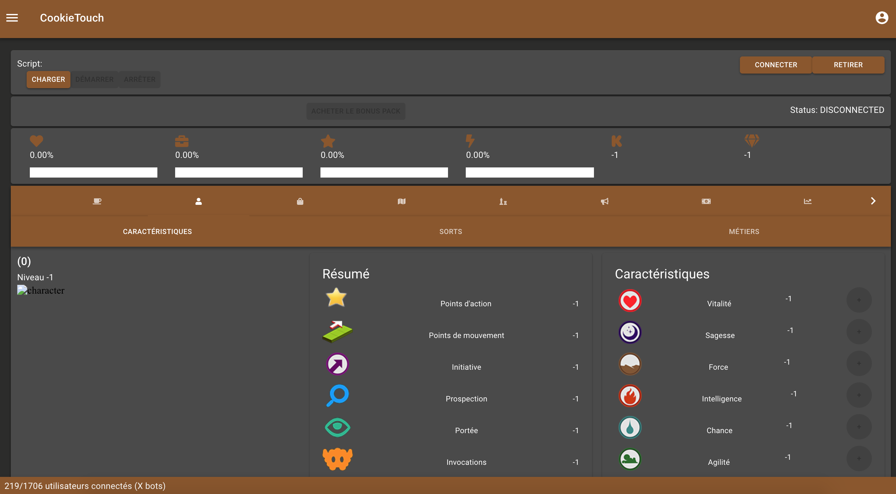

# Coffee Theme

## Preview



## Code

This is the code to save in a `.json` file.

```json
{
    "palette": {
        "common": {
            "black": "rgba(0, 0, 0, 0.86)",
            "white": "rgba(255, 255, 255, 1)"
        },
        "background": {
            "paper": "rgba(74, 74, 74, 1)",
            "default": "rgba(44, 44, 43, 1)"
        },
        "primary": {
            "light": "rgba(255, 255, 255, 1)",
            "main": "rgba(139, 87, 42, 1)",
            "dark": "rgba(139, 87, 42, 1)",
            "contrastText": "rgba(255, 255, 255, 1)"
        },
        "secondary": {
            "light": "rgba(245, 166, 35, 1)",
            "main": "rgba(139, 87, 42, 1)",
            "dark": "rgba(139, 87, 42, 1)",
            "contrastText": "#fff"
        },
        "error": {
            "light": "rgba(208, 2, 27, 1)",
            "main": "rgba(208, 2, 27, 1)",
            "dark": "rgba(208, 2, 27, 1)",
            "contrastText": "#fff"
        },
        "text": {
            "primary": "rgba(255, 255, 255, 100)",
            "secondary": "rgba(155, 155, 155, 1)",
            "disabled": "rgba(0, 0, 0, 0.38)",
            "hint": "rgba(0, 0, 0, 0.38)"
        }
    }
}
```
