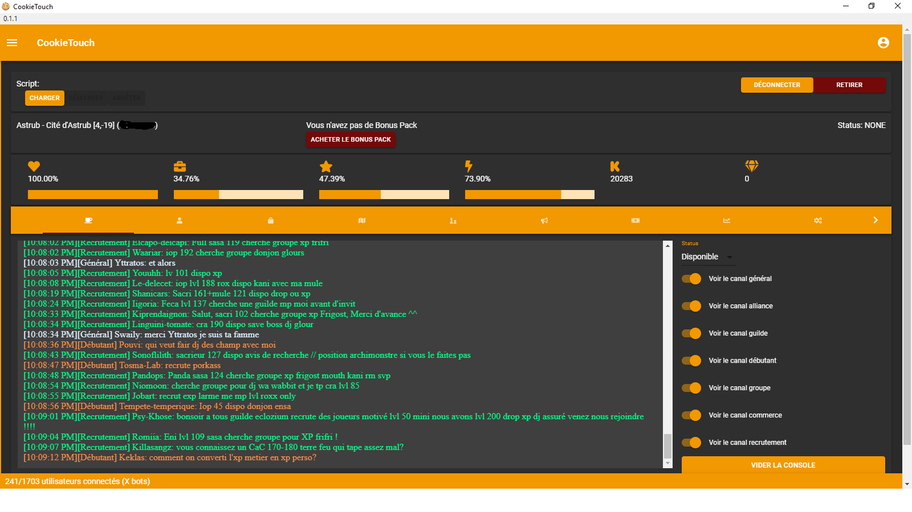

# Halloween Theme

## Preview



## Code

This is the code to save in a `.json` file.

```json
{
   "palette":{
      "common":{
         "black":"rgba(116, 9, 9, 1)",
         "white":"rgba(255, 255, 255, 1)"
      },
      "background":{
         "paper":"rgba(47, 47, 47, 1)",
         "default":"rgba(42, 42, 42, 1)"
      },
      "primary":{
         "light":"rgba(255, 187, 74, 1)",
         "main":"rgba(242, 152, 0, 1)",
         "dark":"rgba(192, 122, 0, 1)",
         "contrastText":"rgba(255, 255, 255, 1)"
      },
      "secondary":{
         "light":"rgba(217, 79, 79, 1)",
         "main":"rgba(116, 9, 9, 1)",
         "dark":"rgba(75, 2, 2, 1)",
         "contrastText":"rgba(255, 255, 255, 1)"
      },
      "error":{
         "light":"rgba(79, 101, 217, 1)",
         "main":"rgba(10, 18, 83, 1)",
         "dark":"rgba(2, 12, 75, 1)",
         "contrastText":"rgba(255, 255, 255, 1)"
      },
      "text":{
         "primary":"rgba(255, 255, 255, 1)",
         "secondary":"rgba(242, 152, 0, 1)",
         "disabled":"rgba(255, 255, 255, 1)",
         "hint":"rgba(255, 255, 255, 1)"
      }
   }
}
```
